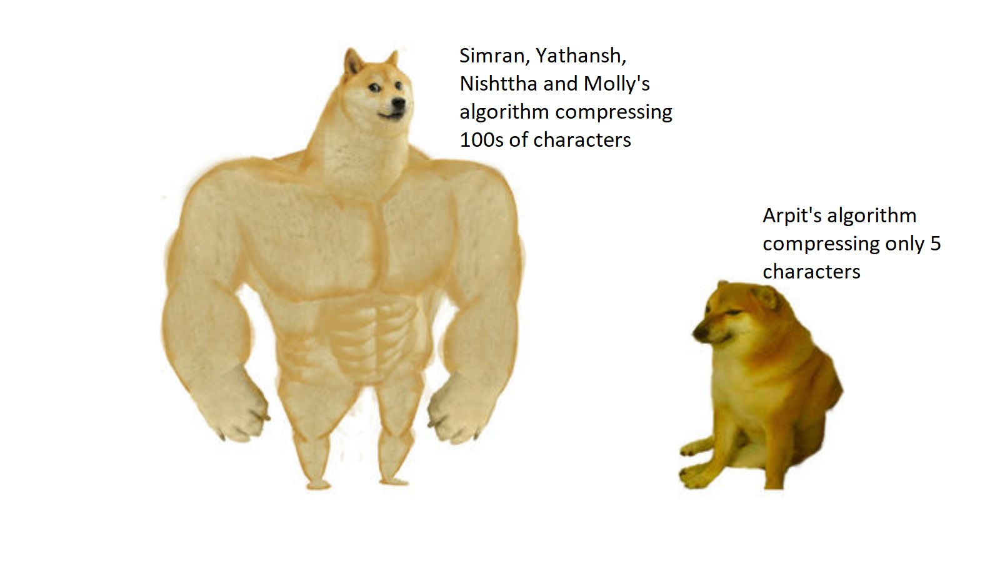

## Project Title
Text Compression in C++

## Problem Statement
In the world of Computer Sciences, ‘compression’ is an important topic. It allows us to compress data (in the form of text, images, videos etc.) by reducing their size. This benefits us in the following ways -
* Save space
* Faster data transmission time
* Better communication bandwidth

Text compression involves changing the representation of a given piece of text so that the output text/file takes up less space to store and less time to transmit. The output file can then be decompressed to give back the exact original file.

## Our Approach
In this project we will apply different compression algorithms on the given data and use the algorithm which gives the smallest file size.

We have decided to use the following algorithms in our project:
* **Huffman coding (lossless text compression algorithm)** - Algorithm where characters are given variable size lengths. According to this algorithm, the most frequent character gets the smallest code and the least frequent character gets the biggest code.
* **Arithmetic coding (lossless text compression algorithm)** - Algorithm where frequently used characters will be represented by fewer bits and less frequently occurring characters will be represented with more bits, which results in overall usage of fewer numbers of total bits used.
* **Shannon Fano coding (lossless text compression algorithm)** - It is a variable length entropy encoding algorithm which assigns characters codes on the basis of their probabilities of occurrence.
* **LZ77 coding (lossless text compression algorithm)** - Algorithm compresses a given piece of text by replacing repeating characters with references to a single copy of that character, which existed in the original uncompressed text.
* **Fibonacci coding (lossless text compression algorithm)** - Algorithm which encodes integers using fibonacci representation, into binary numbers.

The compressed files will entail the information necessary for decompression, and our program will use it for decoding the coded information and reconstructing the original data without any loss of information.

## File Structure
All the algorithms in our project will be divided into their own separate header files. These will contain relevant code for encoding a given text string, and also a function to decode the encoded text from data structures (arrays and trees) and information provided by the encoding function. They will then be packaged together, as a result of which, the packaged header file can be imported and used in our main C++ program.

## To-Do

| Member                | Algorithm         |
| --------------------- | ----------------- |
| Arpit Jain            | Arithmetic Coding |
| Molshree Sharma       | Huffman           |
| Nishttha Saharkar     | Shannon Fano      |
| Simran Ahuja          | Fibonacci         |
| Yathansh Tewatia      | LZ77              |

## What To do
* All the algorithms are put in seperate files in the algorithms directory 
* Each file has a encode and decode function in them which are wrapped in their respective namespaces
* Encode function takes in raw text and encodes it according to the specified algorithm with all the information required to decode it (for example for huffman encoding store the probabilities of characters with the actual encoded message in the string returned from the encode function)
* decode function takes in an encoded string and returns the decoded string
